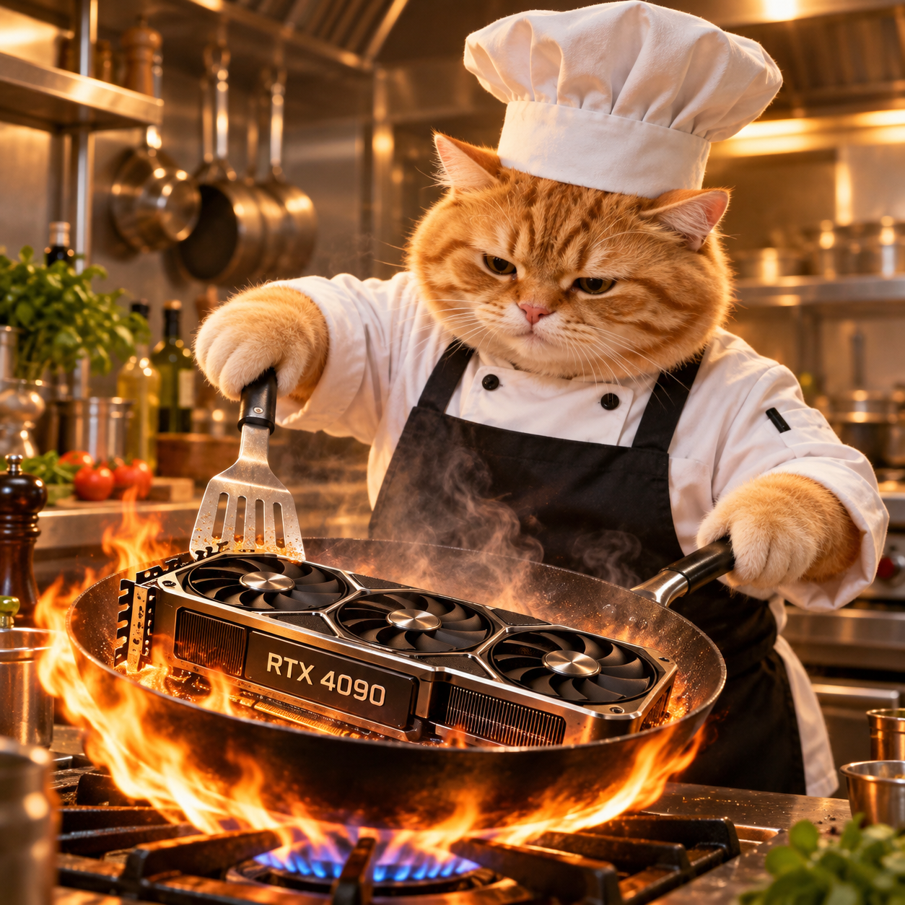

<p align="center">
  
</p>

# cook-4090

Get more from one RTX 4090. Run local chat, generate and edit images, and compare
inference engines through the lightweight cook-4090 Gradio UI.

The project targets Qwen3.8-27B and Qwen-Image-2.1 on Linux with NVIDIA CUDA.
NInfer and llama.cpp provide LLM inference. Diffusers and optional SGLang provide
image generation with reference images and native 2K presets. One worker owns
the GPU at a time.
Build, serving, and benchmark defaults are visible in [run.sh](run.sh).

The application blocks outbound internet connections. Chats, uploads, images,
reports, and logs clear on restart. Download results that you want to keep.
Install dependencies and download models before you start the offline runtime.

## Setup

Use Linux, an RTX 4090, a compatible NVIDIA driver, Git, `uv`, and
`libseccomp.so.2`. Image weights need about 33.1 GB of disk space, in addition
to the environment and caches. Image tests used 60 GiB of host RAM and reached
about 32 GiB of process memory. This is not a minimum host-memory specification.

1. Clone the repository and its engine submodules.

   ```sh
   git clone --recurse-submodules https://github.com/soohl/cook-4090.git
   ```

2. Enter the repository.

   ```sh
   cd cook-4090
   ```

3. Install the pinned UI and image dependencies.

   ```sh
   ./run.sh image-setup
   ```

4. Download the image model.

   ```sh
   ./run.sh image-download
   ```

5. Start cook-4090.

   ```sh
   ./run.sh ui
   ```

Open `http://<server-LAN-IP>:7860` from the same LAN, or
`http://127.0.0.1:7860` on the server. No desktop session is needed.
The UI is unauthenticated and intended for a private LAN.
Stop separately launched GPU servers before you use it.

To add SGLang, run `./run.sh image-sglang-setup` with a C compiler available.
It installs a separate environment and reuses the same BF16 image weights.
Use a driver compatible with that environment's CUDA runtime. Restart the UI,
then select **Qwen-Image-2.1 · SGLang BF16** in the Images tab. Diffusers remains
the default. Each image request releases its worker when it finishes.

## LLM engines

Build an engine with `./run.sh setup ninfer` or `./run.sh setup llamacpp`.
These commands require the CUDA/C++ toolchain and do not download weights.
See the [NInfer build requirements](backends/ninfer/CMakeLists.txt),
[NInfer model card](backends/ninfer/model-cards/Qwen3.8-27B-NInfer/README.md), and
[llama.cpp build guide](backends/llamacpp/docs/build.md).
Set `CUDA_ROOT` if the toolkit is not at `/usr/local/cuda-12.8`.

Supply local weights through `NINFER_WEIGHTS` or `GGUF_WEIGHTS`.
Default paths are in `run.sh`. The llama.cpp profile expects an embedded
multi-token prediction (MTP) head; set `MTP=off` for weights without one.
Configure profiles in [config/models.json](config/models.json).
Restart the UI after configuration changes. The Models tab lists missing artifacts.

## Commands and references

- `./run.sh serve ninfer` or `./run.sh serve llamacpp`: standalone LLM API at
  `http://127.0.0.1:8080/v1`. Unlike the default UI profiles, these commands enable
  vision and require the corresponding vision artifacts.
- `./run.sh image`: generate an image and retain its files under `results/qwen-image/`.
- `IMAGE_ENGINE=sglang ./run.sh image`: use SGLang for the same image command.
- Use the **Benchmarks** tab for matched LLM comparisons and downloadable results.
- `./run.sh test`: run CPU-only application checks.
- `./run.sh help`: list commands and configuration options.
- [Ada implementation and measurements](backends/ninfer/docs/ada.md).

## Layout and model storage

- `src/`: UI, inference adapters, and GUI benchmarking.
- `config/models.json`: local model profiles.
- `models/`: downloaded weights. Qwen-Image-2.1 uses `models/qwen-image-2.1/`.
  Default LLM paths are `models/dflash2/qwen3_8_27b.ninfer` and
  `models/comparison/unsloth/Qwen3.8-27B-UD-Q4_K_XL.gguf`.
- `assets/`: shared README and UI artwork.
- `tests/`: CPU and browser checks.
- `build/`: environments, caches, and disposable UI sessions.

Model weights, builds, CLI image results, and local `docs/` notes are ignored by Git.
The repository includes an empty `models/` directory for local weights.
The repository uses the [Apache 2.0 license](LICENSE). Engines and models retain
their own licenses. Qwen-Image-2.1 uses the Qwen Research License.
